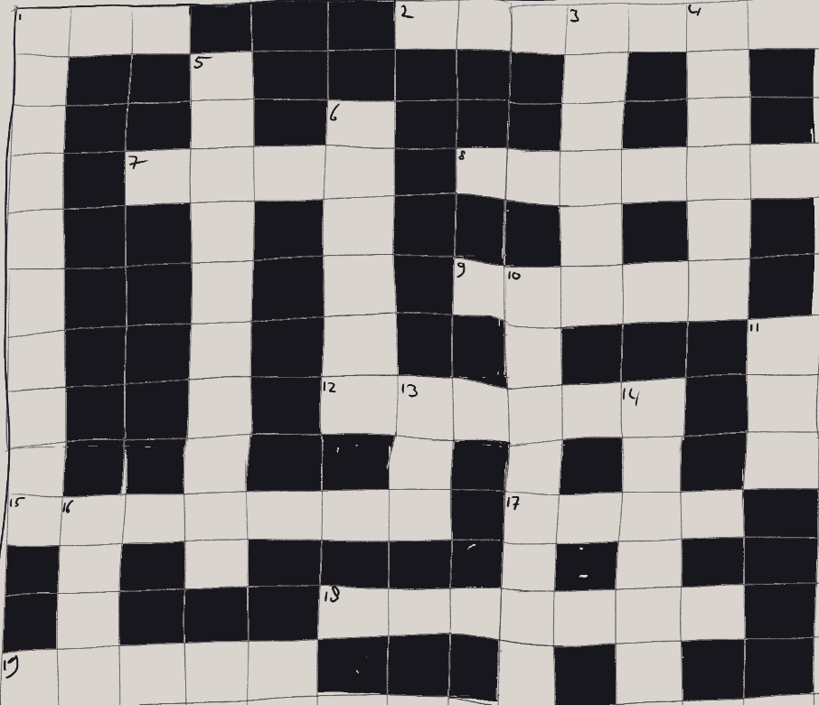
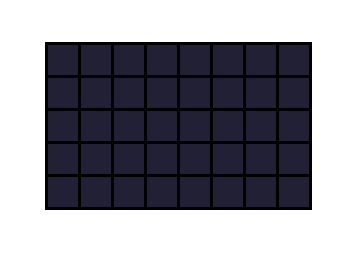
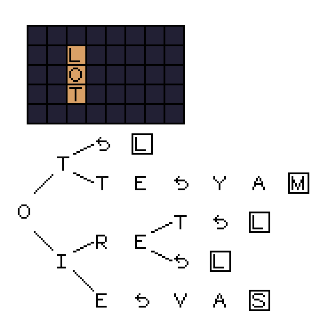

# Crossword Puzzle Generator
My daily crossword puzzle used to ask for a French department quite often. I never got these questions correct, so I decided to just memorize all French departments.
Right after I memorized all French departments with less than or equal to thirteen letters, they completely stopped asking for French departments and starting asking for Spanish provinces instead...

That did leave me with a question , is it possible to create a crossword puzzle with only French departments? After some fiddling with pen and paper, turns out that the answer is yes.

While I'm quite fond of it, compared to the crossword puzzles I know, it has fewer questions and there are more empty squares than I would like.
That is why this project exists, to find a crossword puzzle that is more dense and has more questions than the one I made by hand.

## Generating a Random Puzzle

You can generate a crossword puzzle by using the following command in the directory of the script.

`python generate_crossword.py [Width] [Height] [path/to/file.txt] [nr_of_tries]`

For example, you could use the following command:

`python generate_crossword.py 13 13 dictionary.txt 10`

The script then prints the densest puzzle, as well as the puzzle with the most questions that it found within the amount of tries specified.

## Behind the Scenes
First the script chooses a random square, and puts that square in a set.
Next we start the main loop:

1. Pick a random square from the set (initially just the random one).
2. Find a list of words that could fit in that square using the data structure described below.
3. Randomly pick a word from that list and add it to the puzzle.
4. Record which squares the new word uses and add the squares to the set.
5. If no words fit, then remove the square (from step 1) from the set.

Then we repeat the loop until no more squares are in the set.

In the example, after the first word LOT is added, the square with the O is selected to add a word.
The department 'MAYOTTE' does not fit in the puzzle, as the M falls outside of the puzzle area, but 'LOIRET' does.
This word is added to the puzzle, and it's squares added to the set, including that same square in case we can fit another word there.
In the animation that same square get selected again, but this time no more words fit, so it is removed from the set.
Once all squares from the set have been tried, we the puzzle is finished.
We repeat this process as often as specified and return both the densest puzzle, as well as the puzzle with the most questions.

## Data Structure

I took inspiration from [This paper](https://dl.acm.org/doi/10.1145/42411.42420) about storing words for a scrabble computer.
Appel and Jacobson store words in a tree like structure they call a Trie, where every letter of the word corresponds to an edge in the Trie, and the node specifies if a word can end.
You can then travel down the tree to find words that could be valid plays.

The Node in this script both stores the letter and whether the word can end at that letter.
However, I wanted to be able to look for a word starting from any letter in that word.
That is, to find words that fit on the 'O' from 'LOT', we don't have to look for every word that has an 'O' in it,
but instead look in the 'O' tree, find the letters after the 'O' and afterwards the letters before the 'O'.

For this functionality I use a designated character (just a comma ','), that signifies that the end of the word is reached, but that there are still letters on the front if the word.
The animation below shows how 'MAYOTTE' is written from the data structure to the puzzle. First OTTE is found from left to right.
Then, after the turning character, we write 'YAM', right to left.

This made looking for words that fit a certain square much easier.
However, this does mean that a single word exists multiple times in the data structure (especially longer words).
For example, adding 'APPLE' to the tree means adding 'APPLE', 'APPL,E', 'APP,LE', 'AP,PLE' and 'A,PPLE'.
But with only 87 entries in my French department dictionary it wasn't an issue.
